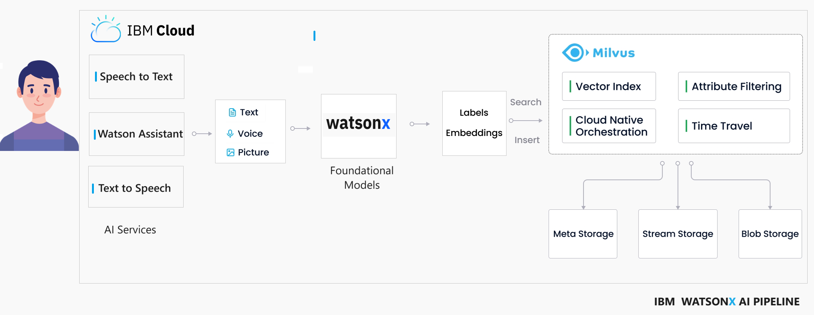

# Watsonx Assistant with Milvus as Vector Database

Hello everyone, today We are going to build a WatsonX Assistant with Milvus as Vector Database. 

# Introduction 

In this blog, we will explore the development of a  WatsonX Assistant that can engage in voice interactions and deliver responses using synthetic speech from Watsonx.ai within a Vector Database. This innovative solution harnesses the power of the latest artificial intelligence models, for retrieving questions. Specifically, we will delve into the integration of a Milvus Vector Database within a healthcare use case, creating a virtual assistant doctor for an enhanced patient experience.

Milvus is a database designed to store, index, and manage massive embedding vectors generated by deep neural networks and other machine learning models. It is capable of indexing vectors on a trillion scale and is built to handle embedding vectors converted from unstructured data, which has become increasingly common with the growth of the internet. 

By calculating similarity distances between vectors, WatsonX.ai's Foundation Model analyzes the questions using the Augmented Knowledge Base created by Milvus. This process allows for the examination of correlations between original data sources. In our specific case, we have numerous questions and answers, and our goal is to identify the best answer for each given question.

# Setup

First we need to install our Vector Database. The sytem where we want to deploy our database is Ubuntu 22.04 

