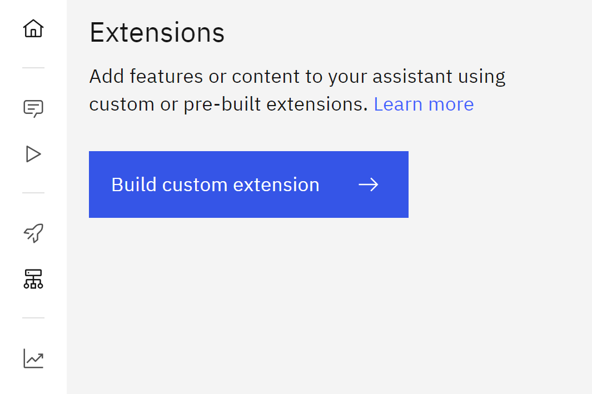
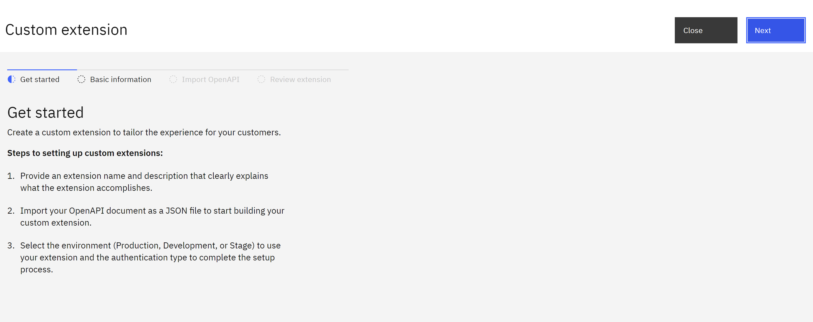
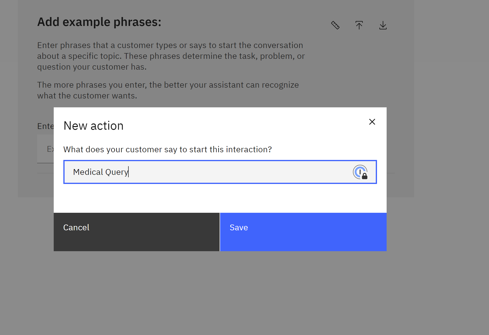
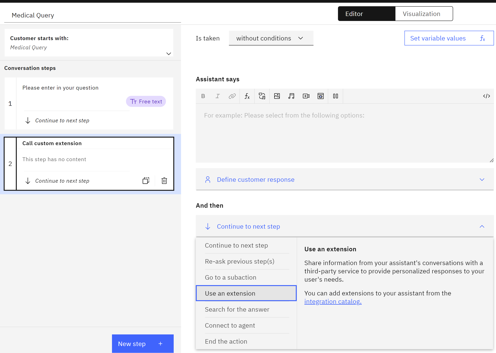
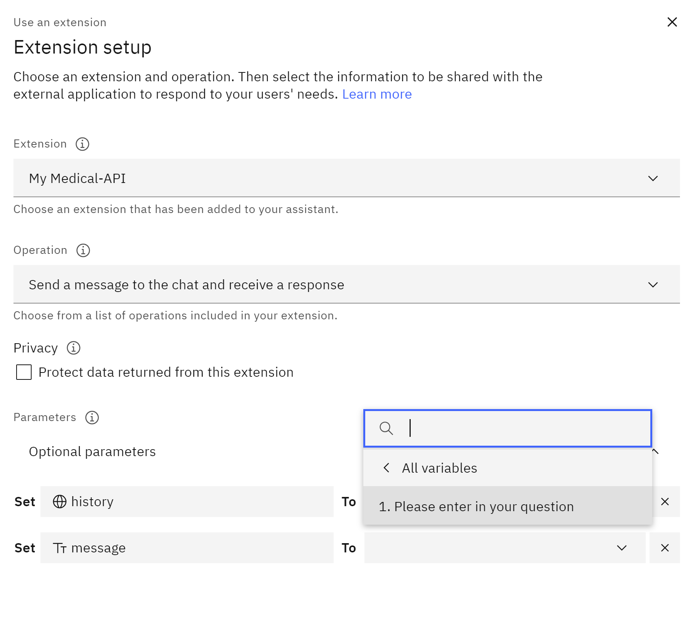
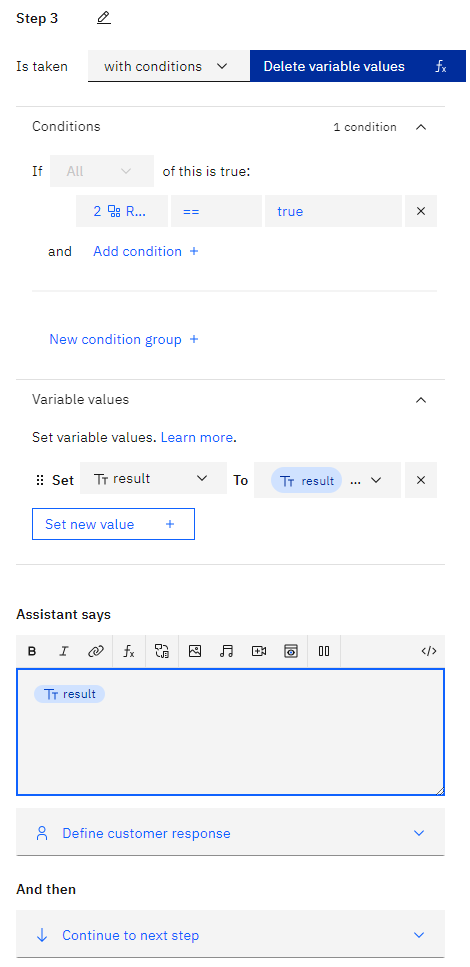
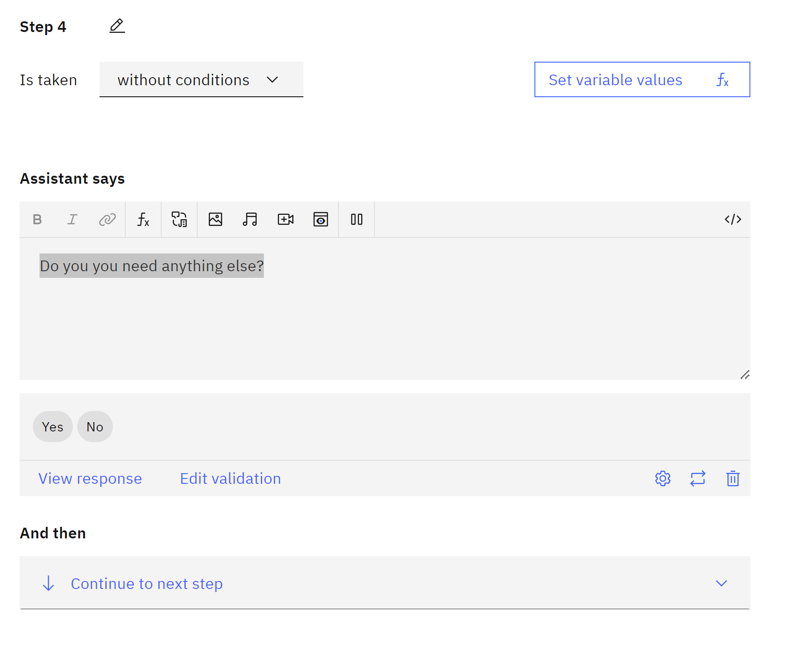
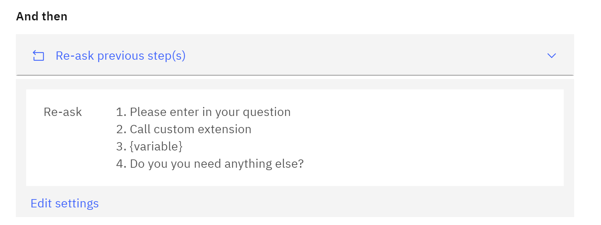
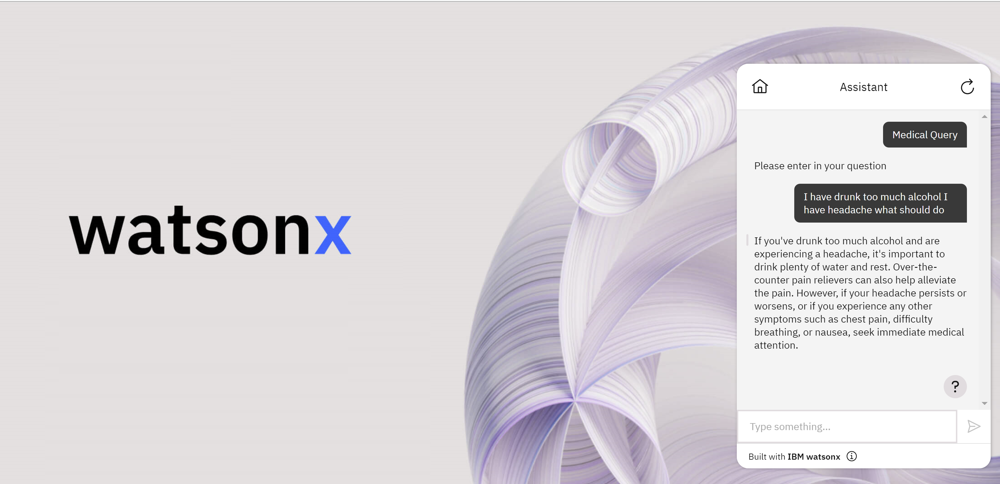
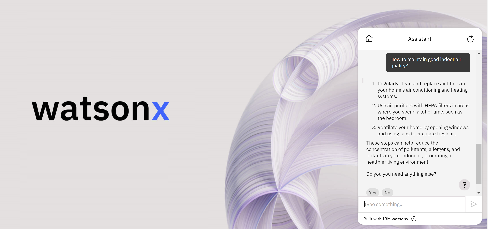

## Creating a Watson Assistant with a Custom Extension (MedicX)


This tutorial guides you through creating a Watson assistant that utilizes a custom extension (MedicX) to interact with an external API. We'll achieve this without dialog skills or webhooks, focusing on modern actions and extension calls.

### Prerequisites:

* An IBM Cloud account with access to Watson Assistant service
* Basic understanding of Watson Assistant and creating actions

### Steps:

1. **Create a New Watson Assistant:**
    * Log in to your IBM Cloud account and access the Watson Assistant service.
    * Click on "Create assistant" and provide a name and description for your assistant.
     
     
    * Click "Create" to initiate the assistant creation.
     
2. **Build the Custom Extension:**
    * Navigate to the "Integrations" tab within your newly created assistant.
    * Click on "Build custom extension."
     
    * In the "Basic information" section, provide a name and description for your custom extension (e.g., MedicX Extension).
     
    * Click "Next" to proceed to the "Import OpenAPI" step.
    * In this step, you'll import the OpenAPI document (openapi.json) that describes the MedicX API. You can typically find this file on the MedicX developer portal or documentation. Click "Browse" and select the `code-engine/openapi.json` file (replace with the actual location of your file)
    
    * Click "Next" to review the imported operations. This allows you to verify that the extension can interact with the MedicX API endpoints as defined in the OpenAPI document.
    * If everything looks good, click "Finish" to create the custom extension.
    

3. **Add the Custom Extension to Your Assistant:**
    * On the "Extensions" dashboard, locate your newly created MedicX extension.
    
    * Click the extension tile and then click "Add" to integrate it with your assistant.
     
    * Follow the on-screen prompts to complete the integration process.
         
4. **Create an Action:**
    * Navigate to the "Actions" tab within your assistant.
    * Click on "Create action" and provide a name and description for your action (e.g., Process Medical Query).
    
    
    * This action will handle user queries and interact with the MedicX API through the custom extension.
    


    5. **Define Action Variables:**
    * In the action editor, create a new assistant variable to store the user's input message. 

    We create the first step, we can say

    ```
    Please enter in your question
    ```
    


    and then we define a custemer response like Free text
    


6. **Call the MedicX API:**


    We create an extra step, the step we name

    `Call custom extension`


  
    * Within continue to next step, you'll use the `Use extension` node to invoke the desired MedicX API endpoint.
    * In the "Extension" dropdown, choose your custom extension (MedicX Extension).
    

    * Select the specific operation you want to call from the MedicX API (e.g., send a message and receive a response).

    * Update the optional parameters as needed.  
    * **Message:** This parameter should be set to the user's input retrieved
    * **History:** (Optional) This parameter might be used by the MedicX API to maintain conversation context. You can leave it blank or populate it based on your specific use case.

    For input message you will choose Action Step Variables and then you choose the first step 1.`Please enter in your question`
    
    This ensures the MedicX API receives the user's query.    
   * Click "Apply" to save the extension call configuration,
    and we will obtain in Step 2 this
    


7. **Process the Response:**
    * After calling the MedicX API,  we create a new step, with conditions, we choose My Medical Api (step2) then Ran successfully 
    

    

    in order to express code we set variable values, and we create a `New session variable`
    

    we name result and will be free text and then apply.

    ```
    ${result} =${body.message}+"\\nOutput: \\n"+${body.response}
   
    ```
    
    
    If you want clean answer try this
    ```
    ${result_clean} =${body.response}

    ```
    
  
    then in the assitant says you add a function result

    

    This might involve parsing the response data, extracting relevant information, and crafting a response for the user.

8. **Ending**
If you want to end you can create a new step
    ```
    Do you you need anything else?
    ```
    
    Create new step for yes
    
    and another for no
    


9. **Test and Train:**
    * Once you've defined the action flow, including the MedicX extension call and response processing, save your action.
    Click on Preview and then type

    ```
    Medical Query
    ```

    then you ask for example

    ```
    I have drunk too much alcohol I have headache what should do
    ```

    you got


    

   * Test your assistant  Watson Assistant to simulate user interactions and observe how your assistant interacts with the MedicX API.
You can try the following question and check it out  in preview


with the question
```
  I have drunk too much alcohol I have headache what should do
```


then yes
```
What precautions should I take to avoid the spread of contagious illnesses, like the flu or common cold, within my household?
```


```
How to maintain good indoor air quality?
```



**By following these steps, you've successfully created a Watson assistant that leverages a custom extension to interact with an external API (MedicX). This empowers your assistant to access valuable data and functionalities from external sources, enhancing its capabilities and user experience.**

